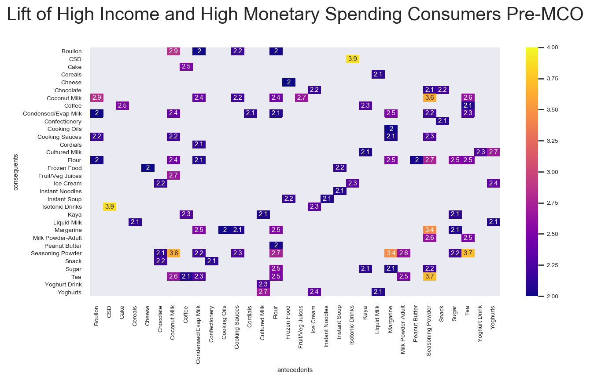
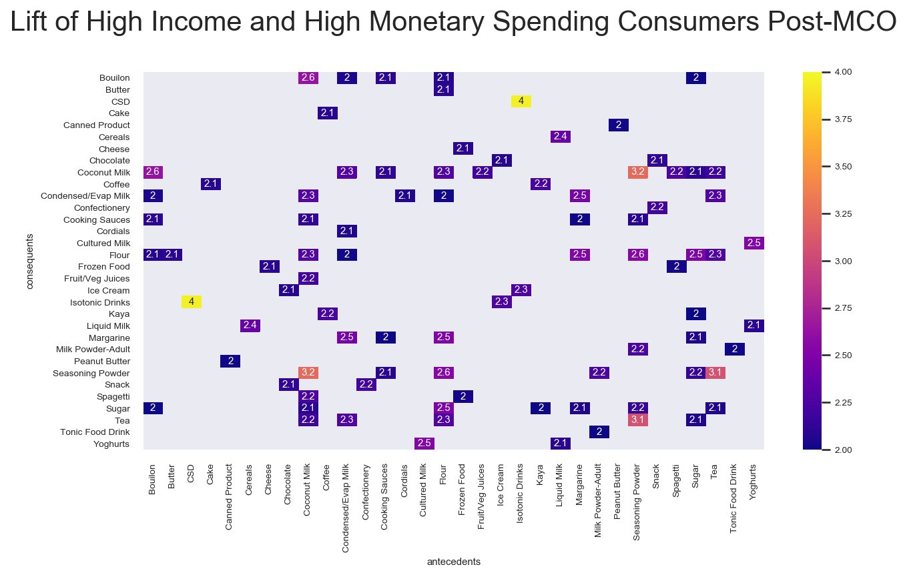
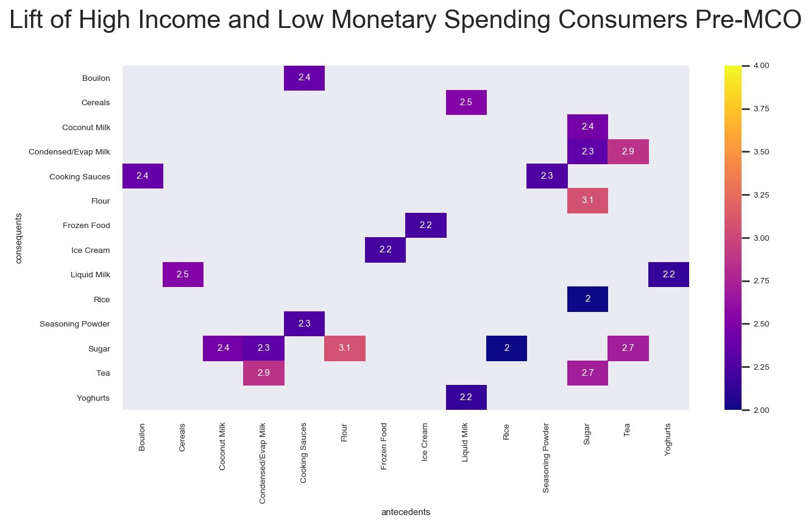
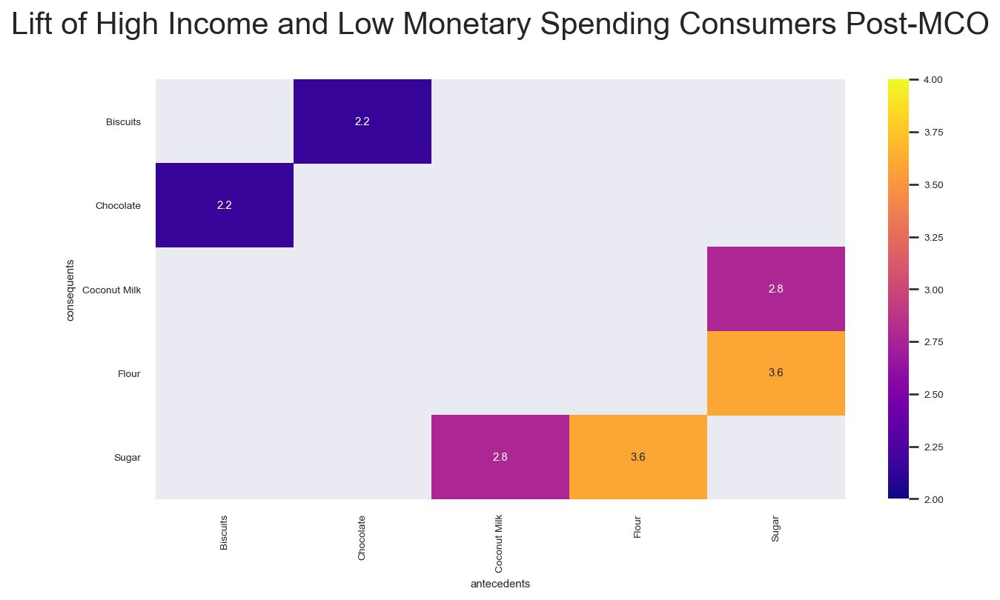

<style type="text/css">

h1.title {
  font-size: 48px;
  text-align: center;
  padding: 25px 0;
}
h4.author { /* Header 4 - and the author and data headers use this too  */
  font-size: 36px;
  font-family: "Times New Roman", Times, serif;
  text-align: center;
}
</style>

\newpage

```{r message=F, warning=F, echo=F}
library(tidyverse)
library(readxl)
library(knitr)
library(lubridate)
library(reticulate)
library(kableExtra)
options(knitr.kable.NA = '')

cat_info <- read_csv("../data/DSA3101_Hackathon_Categories_Information.csv")
data <- read_csv("../data/DSA3101_Hackathon_Data.csv")
panel_demo <- read_excel("../data/DSA3101_Hackathon_Panelists_Demographics.xlsx")

# preprocessing code
# df <- data %>% left_join(cat_info, by="Category") %>% 
#   left_join(panel_demo, by=c("Panel ID" = "ID")) %>% 
#   mutate(Race=case_when(str_detect(Ethnicity, "Malay")~"Malay",
#                              str_detect(Ethnicity, "Chinese")~"Chinese",
#                              str_detect(Ethnicity, "Others")~"Others"),
#        Income=case_when(Income=="Income < 1500" ~ "[0, 1500)",
#                         Income=="Income >5000" ~ "[5000, )",
#                         Income=="Income 1500 - 1999" ~ "[1500, 2000)",
#                         Income=="Income 2000 - 2999" ~ "[2000, 3000)",
#                         Income=="Income 3000 - 3999" ~ "[3000, 4000)",
#                         Income=="Income 4000 - 4999" ~ "[4000, 5000)"))

```

## 1. Introduction

In this report, we aim to use both RFM modeling and MBA, using transaction data collected over the past 3 years, to help guide the client to make strategic business decisions to improve profitability. 

We hope to be able to target these 2 key problem statements and give the client clear and concise recommendations to grow their business.

1. How do we increase revenue for the client?
2. How do we increase customer brand loyalty for the client?

In the later parts, we will be further exploring and elaborating on these ideas and key problems.

We are provided with 3 datasets, namely `DSA3101_Hackathon_Categories_Information.csv`,
`DSA3101_Hackathon_Data.csv` and `DSA3101_Hackathon_Panelists_Demographics.csv`.

## 2. Exploratory Data Analysis (EDA)

### 2.1. Preview of each dataset

#### `DSA3101_Hackathon_Categories_Information.csv` - 62 rows, 3 columns

```{r echo=F}
cat_info %>% head() %>% 
  kable(format="pipe", 
        caption = "Figure 1: First 6 rows of DSA3101_Hackathon_Categories_Information.csv")
# cat(unique(cat_info$Category), sep=", ")
```

The 62 categories are Baby Cereal, Beer, Belacan, Bird Nest, Biscuits, Bouilon, Butter, Cake, Canned Product, Cereal Beverage, Cereals, Cheese, Chicken Essence, Choc/Nut Spread, Chocolate, Coconut Milk, Coffee, Condensed/Evap Milk, Confectionery, Cooking Oils, Cooking Sauces, Cordials, Creamer, CSD, Cultured Milk, Drinking Water, Eggs, Energy Drinks, Flour, Frozen Food, Fruit/Veg Juices, Ghee, Honey, Ice Cream, Instant Noodles, Instant Soup, Isotonic Drinks, Jam, Kaya, Liquid Milk, Margarine, Milk Powder-Adult, Milk Powder-Infant, Milk Powder-Kids, MSG, Peanut Butter, Rice, RTD Coffee, RTD Tea, Salad Dressing, Savoury Spread, Seasoning Powder, Snack, Soy Milk, Spagetti, Spirits, Sugar, Tea, Tonic Food Drink, Wine, Yoghurt Drink, Yoghurts.

```{r echo=F}
select_if(cat_info, is.numeric) %>% summary() %>% 
  kable(format="pipe", caption = "Figure 2: Summary Statistics")
```

Cross-referencing with other sources, we found that the zero calories (MSG and Drinking Water) is indeed true.

-------------------

#### `DSA3101_Hackathon_Data.csv` - 1318024 rows, 6 columns

```{r echo=F}
data %>% head() %>% 
  kable(format="pipe", caption = "Figure 3: First 6 rows of DSA3101_Hackathon_Data.csv")
```

This dataset consists of 156 Sundays (3 full years) which spans from 2017-06-25 to 2020-06-14.

```{r echo=F}
select_if(data, is.numeric) %>% summary() %>% 
  kable(format="pipe", caption = "Figure 4: Summary Statistics")
```

There are entries with value zero in the 3 numerical columns of Volume , Pack Size and Spend. 
It could possibly be due to rounding errors (as the values are rounded to nearest 1 decimal place) or simply a mistake in recording.

-------------------

#### `DSA3101_Hackathon_Panelists_Demographics.csv` - 4026 rows, 8 columns

```{r echo=F, message=F}
panel_demo %>% head() %>% 
  kable(format="pipe", 
        caption = "Figure 5: First 6 rows of DSA3101_Hackathon_Panelists_Demographics.csv")

panel_demo <- panel_demo %>% 
  mutate(Income=case_when(Income=="Income < 1500" ~ "[0, 1500)",
                        Income=="Income >5000" ~ "[5000, )",
                        Income=="Income 1500 - 1999" ~ "[1500, 2000)",
                        Income=="Income 2000 - 2999" ~ "[2000, 3000)",
                        Income=="Income 3000 - 3999" ~ "[3000, 4000)",
                        Income=="Income 4000 - 4999" ~ "[4000, 5000)"),
         Race=case_when(str_detect(Ethnicity, "Malay")~"Malay",
                             str_detect(Ethnicity, "Chinese")~"Chinese",
                             str_detect(Ethnicity, "Others")~"Others"))
```

```{r echo=F, message=F}
lapply(colnames(panel_demo)[c(6,8,2,3,5,7,4)], 
       function(x){table(panel_demo[[x]])/nrow(panel_demo)}) %>% 
  kable(format="pipe", 
        col.names=c("", "Proportion"), 
        caption = "Figure 6: Proportion of each columns")
```

### 2.2. Background Information 

```{r echo=F, message=F, eval=F}
panel_demo %>% 
  group_by(Race, Income) %>% summarise(n=n()) %>% 
  mutate(n=n/sum(n)) %>%
  spread(key=Income, value=n) %>% kable()
```

```{r echo=F, message=F}
panel_demo %>% 
  group_by(location, Income) %>% summarise(n=n()) %>%
  mutate(n=n/sum(n)) %>%
  spread(key=Income, value=n) %>% 
  kable(format="pipe", caption = "Figure 7: Location VS Income")
```

We observe that Central (Capital of Malaysia - Kuala Lumpur) and South (Closer to Singapore) regions are generally more wealthy than North and East Coast. Therefore one possible way of increasing profits for the client would be to increase the pricing of items in the central area.

```{r echo=F, message=F, fig.width=10}
data %>% 
  filter(Category %in% 
           c("Rice", "Canned Product", "Biscuits", "Flour", "Frozen Food",
             "Sugar", "Instant Noodles")) %>%
  group_by(Date, Category) %>% summarise(n=n()) %>% ggplot() +
  geom_line(aes(x=Date, y=n, color=Category)) + 
  geom_vline(xintercept=as.Date("2020-03-22"), colour="black", linetype="dotted") +
  theme(legend.position = "bottom") + ylab("Number of Transactions") +
  labs(title="Figure 8: Essential goods transactions over time")
```

We observed that there was a spike in the sales transactions of essential goods such as rice, frozen food. We did further investigation and discovered that Malaysia announced their Movement Control Order (MCO) on 2020-03-18 (Wednesday). Therefore, we believe that this increase in sales may be of interest to the client, and would like to further investigate on how to increase brand loyalty due to possible increase in new customers. 

\newpage

## 3. Preprocessing

### 3.1 Data Imputation

From the summary statistics, we have identified that there was erroneous data for three different categories of **Pack Size, Volume and Spend**

```{r echo = F}
head(filter(data, `Pack Size` == 0 | `Volume` == 0 | `Spend` == 0)) %>% 
  kable(format="pipe", caption = "Figure 9: Examples of erroneous data")
```

We observe that there are 49539 such instances of misrecorded/missing data therefore, we propose a few ways to handle the missing data. 

1. Since the missing data takes up 3.8% of the entire dataset, we can choose to disregard the missing data as missing data that is less than 5% of the dataset is usually inconsequential. (Schafer, 1999)

2. We can choose to impute the data using kNN imputation. However, we will need to decide which data we want to use to impute. 

We will try to impute the data using the median, as we observe that the dataset has some great outliers. (Anil et al, 2019)

```{r echo=F, message=F, warning=F}
# import python packages here
np <- reticulate::import('numpy')
pd <- reticulate::import('pandas')
preprocessing <- reticulate::import('sklearn.preprocessing')
enable_iterative_imputer <- reticulate::import('sklearn.experimental.enable_iterative_imputer')
impute <- reticulate::import('sklearn.impute')
```

We first encode these different categories into labels. Next, we replace all the zero values in these categories to NaN for imputation. Then, we perform imputation with the median value.

```{python echo=F, message=F, results='hide'}
data_cleaned = r.data
data_cleaned['Date'] = r.pd.to_datetime(data_cleaned['Date'])
le = r.preprocessing.LabelEncoder()
categories = data_cleaned.loc[:,"Category"]
le.fit(categories)
newcat = le.transform(categories)
data_cleaned = data_cleaned.assign(Category = newcat)
```

```{python echo=F, message=F}
# Then, we replace all the zero values in these categories to NaN for imputation.
cols = ["Volume","Pack Size","Spend"]
data_cleaned[cols] = data_cleaned[cols].replace({0:r.np.nan})
```

```{python echo=F, message=F, results='hide'}
# Next, we perform imputation with the median value
imp_median = r.impute.IterativeImputer(random_state=0,initial_strategy = "median")
imp_median.fit(data_cleaned[["Volume","Pack Size", "Spend"]])

Y = data_cleaned[["Volume","Pack Size", "Spend"]]
newY = imp_median.transform(Y)
```


```{python echo=F, message=F}
# Some final processing bits for the data
subarray0 = r.np.delete(r.np.delete(newY,2, 1),1,1)
subarray1 = r.np.delete(r.np.delete(newY,0, 1),1,1)
subarray2 = r.np.delete(r.np.delete(newY,0, 1),0,1)
data_cleaned['Volume'] = r.np.round(subarray0,1)
data_cleaned['Pack Size'] = r.np.round(subarray1,0)
data_cleaned['Spend'] = r.np.round(subarray2,1)
data_cleaned['Category'] = categories
```

```{python echo=F}
# Testing to see if there are any errors with the new imputed data
data = data_cleaned
```

```{r echo=F}
py$data_cleaned %>% select(4:6) %>% summary() %>% 
  kable(format="pipe", caption = "Figure 10: Summary Statistics after imputation")
```

<!-- Examples from the previous dataset against the new imputed. -->

```{python echo=F}
filter_1 = data_cleaned['Panel ID'] == "Panel 108052110" 
example_cleaned = data_cleaned[filter_1]
```

```{r echo=F}
data %>% filter(Volume == 0, `Panel ID` == "Panel 108052110") %>% 
  head(2) %>% 
  kable(format="pipe", 
        caption = "Figure 11: Examples of preimputed errorneous data")

py$example_cleaned %>% mutate(Date=as_date(Date)) %>% head(2) %>% 
  kable(format="pipe", 
        caption = "Figure 12: Examples of postimputed errorneous data")
```

However we understand the pros and cons of these various methods on how to handle the missing data.

- Deleting Missing Data

  - Pros:
It is a simple method that we can use easily.

  - Cons:
If the data removed is significant, it may affect our results. However, it may not significantly impact the insights we obtain,  as the data is less than 5% of the entire dataset.

- Imputation using regression imputer

  - Pros:
Regression imputer may reduce bias of the dataset.
We know that it will not introduce any additional assumptions.

  - Cons:
It is rather time consuming to split the dataset into the categories and perform the imputation.
Without splitting, the regression imputer is unable to treat the categories as factors, 
thereby affecting the quality of the imputation.

Therefore, our team ultimately chose to proceed to just remove the data.

```{r echo=F}
data <- filter(data, `Pack Size` != 0, Volume != 0, Spend != 0)
```

\newpage

## 4. Analysis

### 4.1. RFM Modelling over Time

Assumptions:

1. Weekly data represents the purchases a customer has made in that particular week.
Since there is no data on receipts, we shall treat this as a single visit for computing frequency score.

Example: Customer A who has made 10 transactions 4 weeks ago is not as frequent as 
Customer B who has made 1 transaction each consistently for 4 weeks.

#### Approach

We group by the Panel ID and Date first to compile the transactions in 1 single receipt for that week. Then we group by Panel ID to apply RFM. The monetary is computed based on mean expenditure rather than the total sum to as the total sum is easily influenced by the frequency of the visits
(collinearity issues)

Due to the largely skewed dataset, we will **not** be performing quantile cuts. This is so 
Instead, we will be doing manual segmentation as it is more robust and the results are more interpretable.

This is how we will be representing the different R, F and M values. 

- Recency
  - 3: Last visit was <= 1 week ago
  - 2: Last visit was  <= 2 weeks ago
  - 1: Last visit was > 2 weeks ago
- Frequency
  - 3: >= 9 visits in 12 weeks
  - 2: < 9 visits in 12 weeks (average twice every three weeks)
  - 1: < 6 visits in 12 weeks (average fortnightly visits)
- Monetary
  - 3: >= RM60 mean spending in a week
  - 2: < RM60 mean spending in a week
  - 1: < RM30 mean spending in a week

```{r echo=F, message=F, fig.width=10, fig.height=8}
maxDate <- max(data$Date)
mcoDate <- ymd("2020-03-18")
mcoPrevSunDate <- ymd("2020-03-15")
minDate <- min(data$Date)

postMCO_weeks <- as.numeric(difftime(maxDate, mcoPrevSunDate, units="weeks"))

threeMonths <- data.frame()
for (i in 1:12){
  x <- data %>% 
    filter((Date < mcoDate - postMCO_weeks*7*(11-i)) & 
             (Date > mcoDate - postMCO_weeks*7*(12-i))) %>%
    group_by(`Panel ID`, `Date`) %>% summarise(Total=sum(Spend)) %>% 
    group_by(`Panel ID`) %>% 
    summarise(Recency = as.numeric(mcoPrevSunDate - postMCO_weeks*7*(11-i) - max(Date))/7,    # convert to in terms of weeks
              Frequency = n(),    
              Monetary = mean(Total)) %>% 
    mutate(Recency = case_when(Recency == 0 ~ 3,    # difference of weeks starts from 1
                               Recency == 1 ~ 2,
                               TRUE ~ 1),
           Frequency = case_when(Frequency < 6 ~ 1,    # rarer than fortnightly visits
                               Frequency < 9 ~ 2,    # 2-3 average weekly visits per month
                               TRUE ~ 3),    # 3-4 average weekly visits per month
           Monetary = case_when(Monetary < 40 ~ 1,    # less than RM40/month
                               Monetary < 60 ~ 2,    # less than RM60/month
                               TRUE ~ 3),    # >= RM60/month
           RFM = str_c(Recency, Frequency, Monetary), Window=i)
  threeMonths <- rbind(threeMonths, x)
}

threeMonths_df <- threeMonths %>% group_by(Window, RFM) %>% summarise(n=n()) %>% 
  group_by(Window) %>% summarise(RFM=RFM, Proportion=n/sum(n))
threeMonths_33x <- threeMonths_df %>% filter(Proportion > 0.1)
threeMonths_31x <- threeMonths_df %>% 
  filter(Proportion < 0.1, str_sub(RFM, 1, 2) == "31")
threeMonths_13x <- threeMonths_df %>% 
  filter(Proportion < 0.1, str_sub(RFM, 1, 2) == "13")
threeMonths_11x <- threeMonths_df %>% 
  filter(Proportion < 0.1, str_sub(RFM, 1, 2) == "11")
threeMonths_others <- threeMonths_df %>% 
  filter(Proportion < 0.1)

ggplot() + 
  geom_line(aes(x=Window, y=Proportion, group=RFM, 
                color="Others"), 
            data=threeMonths_others, size=1.01) +
  geom_line(aes(x=Window, y=Proportion, color=RFM), 
            data=threeMonths_33x, size=1.01) +
  geom_line(aes(x=Window, y=Proportion, group=RFM, 
                color="New: {311, 312, 313}"), 
            data=threeMonths_31x, size=1.01) + 
  geom_line(aes(x=Window, y=Proportion, group=RFM, 
                color="Churn risk: {131, 132, 133}"), 
            data=threeMonths_13x, size=1.01) +
  geom_line(aes(x=Window, y=Proportion, group=RFM, 
                color="Lost: {111, 112, 113}"), 
            data=threeMonths_11x, size=1.01) +
  scale_x_continuous(breaks=seq(1,12)) + theme_bw() +
  theme(legend.position = "bottom", panel.border = element_blank()) + 
  scale_color_brewer(palette="Dark2") + 
  labs(title="Figure 13: RFM proportion changes over time")

```

In general, there are no big changes (with the exception of `RFM = 331`) in terms of the proportion of the RFM for in each window (13 weeks period). 

It is important for us to ensure that the customers who are at risk of churning remains low.
From our segmentation, we can see that most of our customers (~50%) are loyal patrons who visit frequently (score 3) and recently (score 3). 

The outbreak of Coronavirus occurred some time in between window 10 and 11 while 
the MCO happened just before window 12. 

It is obvious that many customers are spending more during the pandemic as seen from the spike in `RFM = 333`.

#### Pre MCO VS Post MCO Period

```{r echo=F, message=F}
preMCO <- data %>% filter((Date < mcoDate) & (Date > mcoDate - postMCO_weeks*7)) %>%
  group_by(`Panel ID`, `Date`) %>% summarise(Total=sum(Spend)) %>% 
  group_by(`Panel ID`) %>% 
  summarise(Recency = as.numeric(mcoPrevSunDate - max(Date))/7,    # convert to in terms of weeks
            Frequency = n(),    
            Monetary = mean(Total)) %>% 
  mutate(Recency = case_when(Recency == 0 ~ 3,    # difference of weeks starts from 1
                             Recency == 1 ~ 2,
                             TRUE ~ 1),
         Frequency = case_when(Frequency < 6 ~ 1,    # rarer than fortnightly visits
                             Frequency < 9 ~ 2,    # 2-3 average weekly visits per month
                             TRUE ~ 3),    # 3-4 average weekly visits per month
         Monetary = case_when(Monetary < 40 ~ 1,    # less than RM40/month
                             Monetary < 60 ~ 2,    # less than RM60/month
                             TRUE ~ 3),    # >= RM60/month
         event = "pre", RFM = str_c(Recency, Frequency, Monetary)) %>% 
  left_join(panel_demo, by=c("Panel ID"="ID"))

postMCO <- data %>% filter(Date > mcoDate) %>%
  group_by(`Panel ID`, `Date`) %>% summarise(Total=sum(Spend)) %>% 
  group_by(`Panel ID`) %>% 
  summarise(Recency = as.numeric(maxDate - max(Date))/7,    # convert to in terms of weeks
            Frequency = n(),    
            Monetary = mean(Total)) %>% 
  mutate(Recency = case_when(Recency == 0 ~ 3,    # difference of weeks starts from 0
                             Recency == 1 ~ 2,
                             TRUE ~ 1),
         Frequency = case_when(Frequency < 6 ~ 1,    # rarer than fortnightly visits
                             Frequency < 9 ~ 2,    # 2-3 average weekly visits per month
                             TRUE ~ 3),    # 3-4 average weekly visits per month
         Monetary = case_when(Monetary < 40 ~ 1,    # less than RM40/month
                             Monetary < 60 ~ 2,    # less than RM60/month
                             TRUE ~ 3),    # >= RM60/month
         event = "post", RFM = str_c(Recency, Frequency, Monetary)) %>% 
  left_join(panel_demo, by=c("Panel ID"="ID"))

postMCOHIHM <- filter(postMCO, Income == "[5000, )", Monetary == 3)$`Panel ID`
postMCOHILM <- filter(postMCO, Income == "[5000, )", Monetary == 1)$`Panel ID`
# data %>% filter(Date > mcoDate, `Panel ID` %in% postMCOHIHM) %>%
#   write_csv("../cleaned_data/postMCOHIHM.csv")
# data %>% filter(Date > mcoDate, `Panel ID` %in% postMCOHILM) %>%
#   write_csv("../cleaned_data/postMCOHILM.csv")
preMCOHIHM <- filter(preMCO, Income == "[5000, )", Monetary == 3)$`Panel ID`
preMCOHILM <- filter(preMCO, Income == "[5000, )", Monetary == 1)$`Panel ID`
# data %>% filter((Date < mcoDate) & (Date > mcoDate - postMCO_weeks*7), 
#                 `Panel ID` %in% preMCOHIHM) %>% 
#   write_csv("../cleaned_data/preMCOHIHM.csv")
# data %>% filter((Date < mcoDate) & (Date > mcoDate - postMCO_weeks*7), 
#                 `Panel ID` %in% preMCOHILM) %>% 
#   write_csv("../cleaned_data/preMCOHILM.csv")

stayed <- intersect(postMCO$`Panel ID`, preMCO$`Panel ID`)
relative <- rbind(preMCO, postMCO) %>% filter(`Panel ID` %in% stayed)
relative %>% group_by(`Panel ID`) %>% 
  summarise(Change=if_else(first(RFM)==last(RFM), "No Change", 
                           str_c(first(RFM), " -> ", last(RFM)))) %>% 
  group_by(Change) %>% summarise(n=n()) %>% mutate(Proportion=n/sum(n)) %>% 
  arrange(desc(Proportion)) %>% head() %>% 
  kable(format="pipe", 
        caption="Figure 14: Relative changes in RFM between Pre MCO and Post MCO")
```

Among the customers who had stayed on, most of them have no changes in RFM scores.
We see a significant increase in terms of Monetary score. This could possibly be due to more customers hoarding on essential items. Therefore, it would be wise to retain as much of these customers as possible and increase brand loyalty to ultimately increase customer spending.

#### Demographic Analysis

A closer examination of the Income subgroups of `RFM = 331` before MCO starts is shown as follows:

```{r echo=F, message=F}
preMCO %>% filter(Recency == 3, Frequency == 3, Monetary == 1) %>% 
  group_by(Income) %>% summarise(Counts=n()) %>% 
  mutate(Proportion=Counts/sum(Counts)) %>% 
  kable(format="pipe", 
        caption="Figure 15: Income subgroups of RFM = 331 before MCO")
```

In particular, one group of customers that are of interest are our loyal customers (**high R and F**) who are in the **high income bracket** but have **low M values**. Interestingly, this group of customer actually comprises a significant proportion among the high R and F segment! 

This further reinforces our beliefs to target them as they are capable of spending more. If we can entice these customers (RFM = 331) to change their consumption patterns to become more like their high income high M counterparts, it will help to increase revenue for the client!

```{r echo=F, message=F, eval=F}
high_income <- filter(panel_demo, Income == "[5000, )")
lapply(colnames(high_income)[c(2, 5:9)], 
       function(x){
         table(high_income[[x]])/nrow(high_income)}) %>% 
  kable(format="pipe", 
        col.names=c("", "Proportion"), 
        caption="Figure 16: Proportion of each columns for Income > 5000")
```

```{r echo=F, message=F}
demo_als <- preMCO %>% filter(Recency == 3, Frequency == 3, Monetary == 1, 
                  Income == "[5000, )")
lapply(colnames(preMCO)[c(7, 10:14)], 
       function(x){table(demo_als[[x]])/nrow(demo_als)}) %>% 
  kable(format="pipe", 
        col.names=c("", "Proportion"), 
        caption="Figure 16: Proportion of each columns for Income > 5000 with RFM = 331 before MCO")
```

```{r echo=F, message=F}
demo_als <- postMCO %>% filter(Recency == 3, Frequency == 3, Monetary == 1, 
                  Income == "[5000, )")
lapply(colnames(preMCO)[c(7, 10:14)], 
       function(x){table(demo_als[[x]])/nrow(demo_als)}) %>% 
  kable(format="pipe", 
        col.names=c("", "Proportion"), 
        caption="Figure 17: Proportion of each columns for Income > 5000 with RFM = 331 after MCO")
```

From the above analyses on the subgroups of customers in the high income bracket, 
they are largely coming from smaller households, which could partly explain the lower consumption (hence lower expenditure).

```{r echo=F, message=F}
m_inc <- relative %>% filter(Recency == 3, Frequency == 3) %>% 
  arrange(desc(event)) %>% group_by(`Panel ID`) %>% 
  summarise(IncreaseM=as.numeric(last(Monetary) > first(Monetary))) %>% 
  filter(IncreaseM == 1) %>% left_join(panel_demo, by=c("Panel ID"="ID"))

lapply(colnames(m_inc)[c(3,4,6:10)], 
       function(x){table(m_inc[[x]])/nrow(m_inc)}) %>% 
  kable(format="pipe", 
        col.names=c("", "Proportion"),
        caption="Figure 18: Proportion of each columns for customers with R = 3, F = 3 and experienced an increase in M after MCO")
```

Therefore, we recommend to push more advertisements for smaller but more luxurious towards these customers that were identified as RFM = 331 and high income level. This is because we identify these customers as most likely to spend, but due to their demographic may not buy as much items. 

-------------------

### 4.2. Market Basket Analysis

We thus now turn to analysing the market baskets of the 2 groups to explain the discrepancy and hopefully obtain some insight as to how we can promote greater spending. After generating the MBA results for the two groups before and after MCO started with minimum support = 0.01 and minimum lift = 2, we then ranked them by lift.

```{r, echo=F}
preMCOHIHM_mba_rules <- read.csv("../cleaned_data/MBA_PreMCO_HIHM.csv") %>%
  arrange(-lift) %>%
  select(-leverage, -conviction)
preMCOHILM_mba_rules <- read.csv("../cleaned_data/MBA_PreMCO_HILM.csv") %>%
  arrange(-lift) %>%
  select(-leverage, -conviction)
postMCOHIHM_mba_rules <- read.csv("../cleaned_data/MBA_PostMCO_HIHM.csv") %>%
  arrange(-lift) %>%
  select(-leverage, -conviction)
postMCOHILM_mba_rules <- read.csv("../cleaned_data/MBA_PostMCO_HILM.csv") %>%
  arrange(-lift) %>%
  select(-leverage, -conviction)

kable(head(preMCOHIHM_mba_rules, n = 10), format="pipe", 
      caption = "Figure 19: preMCOHIHM")
kable(head(preMCOHILM_mba_rules, n = 10), format="pipe", 
      caption = "Figure 20: preMCOHILM")
kable(head(postMCOHIHM_mba_rules, n = 10), format="pipe", 
      caption = "Figure 21: postMCOHIHM")
kable(head(postMCOHILM_mba_rules, n = 10), format="pipe", 
      caption = "Figure 22: postMCOHILM")
```

It is observed that for high spenders, there is in general a slight increase in lift, which means that they may be sticking tighter to their routine of buying things that they always buy together. The number of rules with lift > 2 also increased after MCO started.

For the low spenders, there is a decrease in lift. This could be attributed to them purchasing randomly, i.e. hoarding, since they seldom had a fix regime of getting things previously when compared to the high spenders. Hence, this implies that they may be a little less prepared in terms of getting things. The number of rules also decreased largely after MCO started, suggesting that their market baskets are shrinking.

Our approaches therefore include two parts:

1. Compare the MBA results of pre- and post-MCO for high income high spenders and look for difference/change after MCO. The target is to retain this group of customers by giving certain promotions to items that can improve sales.

2. Compare the MBA results of pre- and post-MCO for high income low spenders and look for difference/change after MCO. The target is to shift their purchasing habits back to 'normal period', which is before MCO started.

We first look at the results of pre- and post-MCO for both groups:


```{r, echo=FALSE, warning=F}
#post and pre MCO high spending comparison
preMCO_count <- as.data.frame(table(preMCOHIHM_mba_rules$antecedents)) %>%
  arrange(-Freq) %>%
  rename(antecedents = Var1,
         counts = Freq)

postMCO_count <- as.data.frame(table(postMCOHIHM_mba_rules$antecedents)) %>%
  arrange(-Freq) %>%
  rename(antecedents = Var1,
         counts = Freq)

#post and pre MCO low spending comparison
preMCO_count1 <- as.data.frame(table(preMCOHILM_mba_rules$antecedents)) %>%
  arrange(-Freq) %>%
  rename(antecedents = Var1,
         counts = Freq)

postMCO_count1 <- as.data.frame(table(postMCOHILM_mba_rules$antecedents)) %>%
  arrange(-Freq) %>%
  rename(antecedents = Var1,
         counts = Freq)

kable(head(preMCO_count), format="pipe", caption = "Figure 23: Pre-MCO HIHM")
kable(head(postMCO_count), format="pipe", caption = "Figure 24: Post-MCO HIHM")
kable(preMCO_count1, format="pipe", caption = "Figure 25: Pre-MCO HILM")
kable(postMCO_count1, format="pipe", caption = "Figure 26: Post-MCO HILM")

```









From the figures and the tables, we could see that:

1. For high spenders, items like Coconut Milk and Sugar have experienced an increase in the number of antecedent counts, indicating that customers are purchasing a larger variety of goods in tandem with these items.

2. For low spenders, it is observed that while these customers often buy sugar together with things such as tea and milk before MCO started. However, they are not buying them together so often now.

\newpage

## 5. Conclusion

1. We observe that most of the customers with higher purchasing power are in the central and southern location. Therefore, we believe that if we have increased pricing options in the central and southern regions as compared to the rest of the regions these customers tend to be more affluent.

2. We observe that there are a large group of customers that have high affluence and have been recent spenders but are not spending as much. So we propose to target customers with RFM score of 331 and promote advertisements of more luxurious items to increase the profit/customer for those that are more affluent. This can be dont by giving them thank you notes or more discount vouchers on the higher priced items vs lower priced items to reward this customer behaviour.

3. We observe that high spenders have been purchasing more after MCO. To encourage them to continue with this behaviour, we recommend to give promotions to items such as coconut milk and sugar, to further increase spending from high-income-high-spending customers. We also observe that low spenders are purchasing less after MCO. It is thus recommended to place sugar and items such as tea and milk together to encourage high-income-low-spending customers to shift back to their normal purchasing styles, or hold campaigns for this kind of item sets, such as bundle sales.

## 6. Biblography

Schafer, J. L. (1999). Multiple imputation: a primer. Statistical Methods in Medical Research, 8(1), 3–15. https://doi.org/10.1177/096228029900800102

Anil Jadhav, Dhanya Pramod & Krishnan Ramanathan (2019) Comparison of Performance of Data Imputation Methods for Numeric Dataset, Applied Artificial Intelligence, 33:10, 913-933, DOI: 10.1080/08839514.2019.1637138